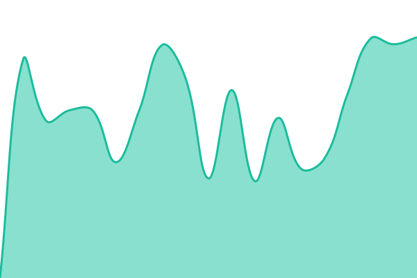
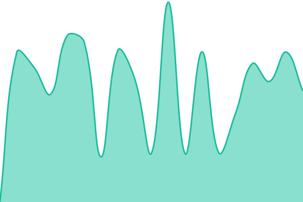
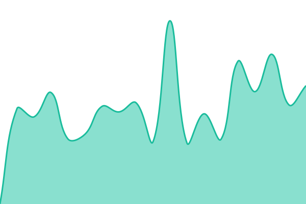
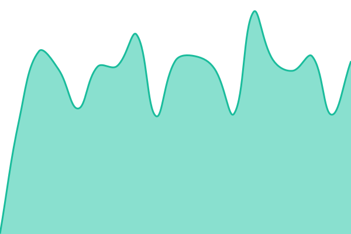
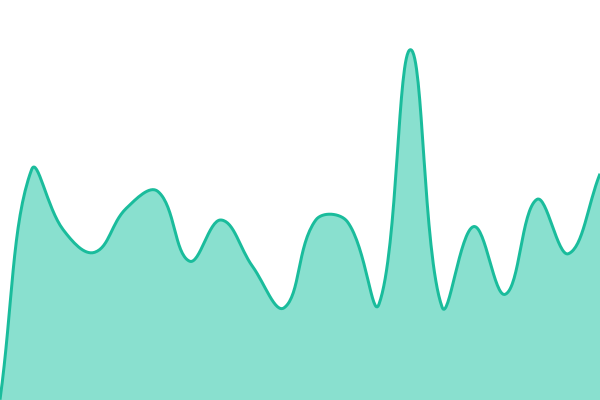
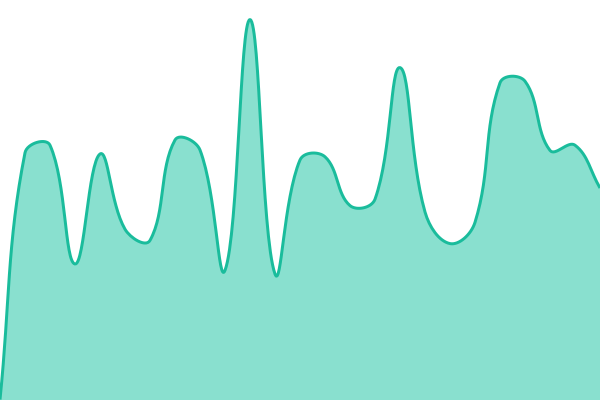
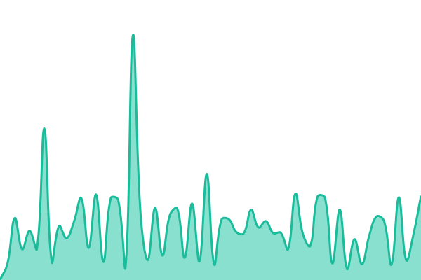
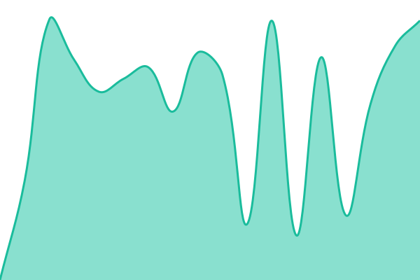

# [📈 Live Status](https://btemperli.github.io/status.temperli.io): <!--live status--> **🟩 All systems operational**

This repository contains the open-source uptime monitor and status page for [Beat Temperli](http://beat.temper.li), powered by [Upptime](https://github.com/upptime/upptime).

With [Upptime](https://upptime.js.org), you can get your own unlimited and free uptime monitor and status page, powered entirely by a GitHub repository. We use [Issues](https://github.com/btemperli/status.temperli.io/issues) as incident reports, [Actions](https://github.com/btemperli/status.temperli.io/actions) as uptime monitors, and [Pages](https://btemperli.github.io/status.temperli.io) for the status page.

<!--start: status pages-->
<!-- This summary is generated by Upptime (https://github.com/upptime/upptime) -->
<!-- Do not edit this manually, your changes will be overwritten -->
<!-- prettier-ignore -->
| URL | Status | History | Response Time | Uptime |
| --- | ------ | ------- | ------------- | ------ |
|  [Temperli](https://temperli.io/web) | 🟩 Up | [temperli.yml](https://github.com/btemperli/status.temperli.io/commits/HEAD/history/temperli.yml) | 

 1481ms
     
 | 

<a href="https://btemperli.github.io/status.temperli.io/history/temperli">97.59%</a>
    

|  [Präsentationen](https://present.temperli.io) | 🟩 Up | [praesentationen.yml](https://github.com/btemperli/status.temperli.io/commits/HEAD/history/praesentationen.yml) | 

 794ms
     
 | 

<a href="https://btemperli.github.io/status.temperli.io/history/praesentationen">97.78%</a>
    

|  [WebTigerJython](https://wtj.temperli.io) | 🟩 Up | [web-tiger-jython.yml](https://github.com/btemperli/status.temperli.io/commits/HEAD/history/web-tiger-jython.yml) | 

 958ms
     
 | 

<a href="https://btemperli.github.io/status.temperli.io/history/web-tiger-jython">97.97%</a>
    

|  [Temperli.Live](https://live.temperli.io) | 🟩 Up | [temperli-live.yml](https://github.com/btemperli/status.temperli.io/commits/HEAD/history/temperli-live.yml) | 

 743ms
     
 | 

<a href="https://btemperli.github.io/status.temperli.io/history/temperli-live">98.16%</a>
    

|  [TypingNinja](https://typingninja.temperli.io) | 🟩 Up | [typing-ninja.yml](https://github.com/btemperli/status.temperli.io/commits/HEAD/history/typing-ninja.yml) | 

 744ms
     
 | 

<a href="https://btemperli.github.io/status.temperli.io/history/typing-ninja">98.35%</a>
    

|  [Dreisatz-Tool](http://dreisatz.temper.li) | 🟩 Up | [dreisatz-tool.yml](https://github.com/btemperli/status.temperli.io/commits/HEAD/history/dreisatz-tool.yml) | 

 531ms
     
 | 

<a href="https://btemperli.github.io/status.temperli.io/history/dreisatz-tool">98.55%</a>
    

|  [Temperli: LED](https://temperli.io/web/led) | 🟩 Up | [temperli-led.yml](https://github.com/btemperli/status.temperli.io/commits/HEAD/history/temperli-led.yml) | 

 688ms
     
 | 

<a href="https://btemperli.github.io/status.temperli.io/history/temperli-led">98.74%</a>
    

|  chottenserver | 🟩 Up | [chottenserver.yml](https://github.com/btemperli/status.temperli.io/commits/HEAD/history/chottenserver.yml) | 

 856ms
     
 | 

<a href="https://btemperli.github.io/status.temperli.io/history/chottenserver">100.00%</a>
    

|  chottenserver info | 🟩 Up | [chottenserver-info.yml](https://github.com/btemperli/status.temperli.io/commits/HEAD/history/chottenserver-info.yml) | 

 642ms
     
 | 

<a href="https://btemperli.github.io/status.temperli.io/history/chottenserver-info">100.00%</a>
    

|  chottenserver fotos | 🟩 Up | [chottenserver-fotos.yml](https://github.com/btemperli/status.temperli.io/commits/HEAD/history/chottenserver-fotos.yml) | 

 537ms
     
 | 

<a href="https://btemperli.github.io/status.temperli.io/history/chottenserver-fotos">100.00%</a>
    

|  chottenserver IP-Adresse | 🟩 Up | [chottenserver-ip-adresse.yml](https://github.com/btemperli/status.temperli.io/commits/HEAD/history/chottenserver-ip-adresse.yml) | 

 580ms
     
 | 

<a href="https://btemperli.github.io/status.temperli.io/history/chottenserver-ip-adresse">100.00%</a>
    

|  [Kanti: Informatik-Seite](https://kanti-informatik.ch) | 🟩 Up | [kanti-informatik-seite.yml](https://github.com/btemperli/status.temperli.io/commits/HEAD/history/kanti-informatik-seite.yml) | 

 590ms
     
 | 

<a href="https://btemperli.github.io/status.temperli.io/history/kanti-informatik-seite">100.00%</a>
    

|  [Kanti: Robotik-Scouting](https://6417.kanti-informatik.ch/scouting) | 🟩 Up | [kanti-robotik-scouting.yml](https://github.com/btemperli/status.temperli.io/commits/HEAD/history/kanti-robotik-scouting.yml) | 

 715ms
     
 | 

<a href="https://btemperli.github.io/status.temperli.io/history/kanti-robotik-scouting">100.00%</a>
    

|  Kanti: Secure Forms (admin-login) | 🟩 Up | [kanti-secure-forms-admin-login.yml](https://github.com/btemperli/status.temperli.io/commits/HEAD/history/kanti-secure-forms-admin-login.yml) | 

 765ms
     
 | 

<a href="https://btemperli.github.io/status.temperli.io/history/kanti-secure-forms-admin-login">98.93%</a>
    

|  Kanti: Secure | 🟩 Up | [kanti-secure.yml](https://github.com/btemperli/status.temperli.io/commits/HEAD/history/kanti-secure.yml) | 

 611ms
     
 | 

<a href="https://btemperli.github.io/status.temperli.io/history/kanti-secure">99.12%</a>
    

|  [Cevi: Logo Generator](https://logo.cevi.ch/?notracking) | 🟩 Up | [cevi-logo-generator.yml](https://github.com/btemperli/status.temperli.io/commits/HEAD/history/cevi-logo-generator.yml) | 

 655ms
     
 | 

<a href="https://btemperli.github.io/status.temperli.io/history/cevi-logo-generator">99.31%</a>
    

|  [Cevi: Logo Generator Admin](https://logo.cevi.ch/admin/login.php) | 🟩 Up | [cevi-logo-generator-admin.yml](https://github.com/btemperli/status.temperli.io/commits/HEAD/history/cevi-logo-generator-admin.yml) | 

 567ms
     
 | 

<a href="https://btemperli.github.io/status.temperli.io/history/cevi-logo-generator-admin">100.00%</a>
    

|  [Cevi: Abteilung Wädi](https://cevi-waedi.ch) | 🟩 Up | [cevi-abteilung-waedi.yml](https://github.com/btemperli/status.temperli.io/commits/HEAD/history/cevi-abteilung-waedi.yml) | 

 2420ms
     
 | 

<a href="https://btemperli.github.io/status.temperli.io/history/cevi-abteilung-waedi">100.00%</a>
    

|  [Stalder](https://stalder-ag.ch) | 🟩 Up | [stalder.yml](https://github.com/btemperli/status.temperli.io/commits/HEAD/history/stalder.yml) | 

 1359ms
     
 | 

<a href="https://btemperli.github.io/status.temperli.io/history/stalder">99.95%</a>
    

|  [Orsopal](https://orsopal.ch) | 🟩 Up | [orsopal.yml](https://github.com/btemperli/status.temperli.io/commits/HEAD/history/orsopal.yml) | 

 1322ms
     
 | 

<a href="https://btemperli.github.io/status.temperli.io/history/orsopal">100.00%</a>
    

<!--end: status pages-->

[**Visit our status website →**](https://btemperli.github.io/status.temperli.io)

## 📄 License

- Powered by: [Upptime](https://github.com/upptime/upptime)
- Code: [MIT](./LICENSE) © [Anand Chowdhary](https://anandchowdhary.com), supported by [Pabio](https://pabio.com)
- Data in the `./history` directory: [Open Database License](https://opendatacommons.org/licenses/odbl/1-0/)
